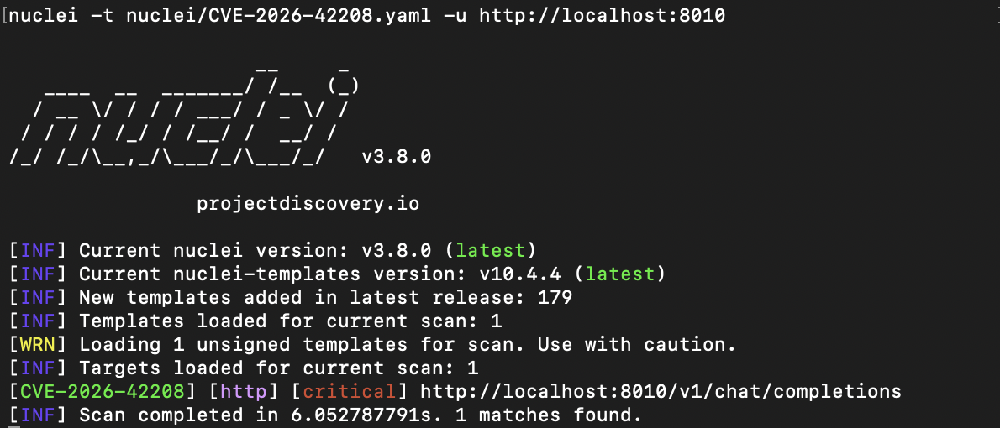
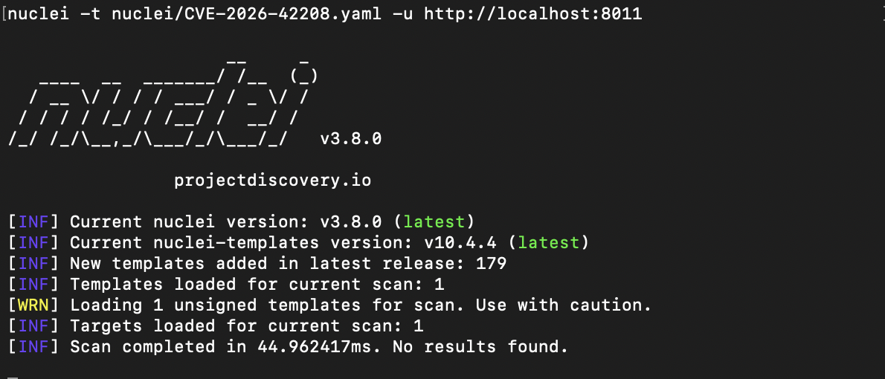

# CVE-2026-42208 랩 환경 보고서

---

## 1. 개요

| 항목 | 내용 |
|------|------|
| **CVE ID** | CVE-2026-42208 |
| **취약점 유형** | Pre-Authentication SQL Injection (Time-Based Blind) |
| **취약한 버전** | LiteLLM >= 1.81.16, < 1.83.7 |
| **패치 버전** | v1.83.7 |

---

## 2. 랩 아키텍처

```
Host Machine
├── localhost:8010 ──→ Docker: litellm-vuln    (v1.83.6-nightly  ⚠ 취약)
│                      Docker: litellm-db-vuln  (PostgreSQL 15)
└── localhost:8011 ──→ Docker: litellm-patched (v1.83.7-stable   ✓ 패치됨)
                       Docker: litellm-db-patched (PostgreSQL 15)
```

각 스택은 독립된 PostgreSQL 컨테이너를 사용하여 데이터 간섭이 없다.

---

## 3. 시드 키 생성의 필요성

PostgreSQL은 `WHERE` 절을 행 단위로 평가한다. `LiteLLM_VerificationToken` 테이블이 비어 있으면 반복 횟수가 0이 되어 `pg_sleep()`이 단 한 번도 호출되지 않는다.

```sql
-- 테이블이 비어 있는 경우
WHERE v.token = '' OR (SELECT pg_sleep(6)) IS NOT NULL --
-- → 스캔할 행이 없음 → pg_sleep 미실행 → 지연 없음
```

실제 LiteLLM 배포 환경에서는 마스터 키 등록 또는 최초 API 키 발급 시 항상 최소 1개의 행이 존재한다. `01-setup.sh`의 시드 키 생성 단계가 이 현실 조건을 재현한다.

---

## 4. 익스플로잇 결과

### 4.1 취약한 인스턴스 (v1.83.6-nightly, 포트 8010)

인젝션 없는 일반 요청의 응답 시간(기준선)은 0.031s였다. 동일한 엔드포인트에 pg_sleep(6) 페이로드를 주입하자 응답 시간이 6.062s로 늘어났다. 기준선 대비 약 6초의 추가 지연이 발생한 것으로, SQL 인젝션이 실행되어 PostgreSQL이 실제로 6초간 대기했음을 의미한다.

| 항목 | 값 |
|------|-----|
| 기준 응답 시간 | 0.031s |
| 페이로드 주입 후 응답 시간 | 6.062s |
| 추가 지연 | +6.031s |
| HTTP 상태 코드 | 401 |

### 4.2 패치된 인스턴스 (v1.83.7-stable, 포트 8011)

동일한 페이로드를 패치된 인스턴스에 전송했을 때 응답 시간은 0.029s로 기준선(0.028s)과 차이가 없었다. 파라미터화 쿼리로 변경된 이후에는 토큰 값이 SQL에 직접 삽입되지 않으므로 pg_sleep이 실행되지 않는다.

| 항목 | 값 |
|------|-----|
| 기준 응답 시간 | 0.028s |
| 페이로드 주입 후 응답 시간 | 0.029s |
| 추가 지연 | +0.001s |
| HTTP 상태 코드 | 401 |

---

## 5. Nuclei 탐지 결과

**취약한 인스턴스 (v1.83.6-nightly, 포트 8010)**

`[CVE-2026-42208] [http] [critical]` 탐지, 스캔 완료까지 6.05초 소요.



**패치된 인스턴스 (v1.83.7-stable, 포트 8011)**

No results found, 스캔 완료까지 44ms 소요.



---

## 6. 탐지 한계 및 주의사항

| 조건 | 영향 |
|------|------|
| `LiteLLM_VerificationToken` 테이블이 비어 있음 | pg_sleep이 실행되지 않아 지연이 발생하지 않으므로 탐지되지 않음 |
| `disable_error_logs: true` 설정 | 에러 처리 경로 자체가 실행되지 않아 인젝션이 발생하지 않음 |
| SQLite 백엔드 | 해당 코드 경로를 사용하지 않아 취약하지 않음 |
| 네트워크 지연 > 5s | 오탐 가능 → 상대적 지연 비교로 완화 |

---

> **주의**: 이 문서의 모든 자격증명은 실험용 가짜 데이터입니다. 실제 운영 환경에 절대 사용하지 마십시오.
